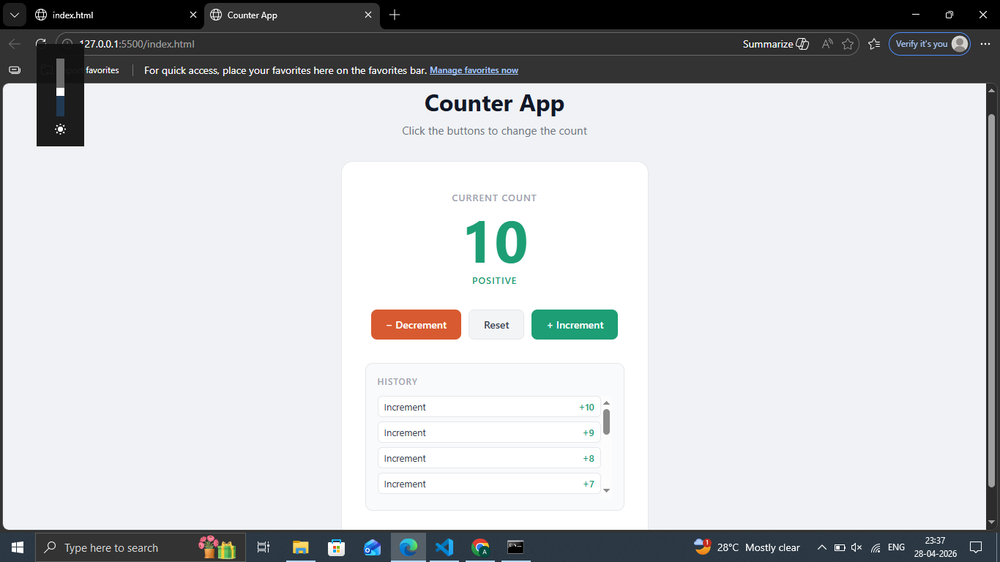

# Day 08 — Counter App

An interactive counter app with color feedback and action history.

## Preview

## Features
- Increment, decrement and reset buttons
- Color changes based on count (green = positive, red = negative)
- Action history shows last 10 interactions
- Smooth transitions on count change

## Tech Stack
- HTML5
- CSS3 (transitions, dynamic classes)
- JavaScript (DOM manipulation, events)

## What I Learned
- Selecting and updating DOM elements with JavaScript
- Adding and removing CSS classes dynamically
- Building a history log with JavaScript arrays
- Event handling with onclick

## Part of
[30 Days 30 Projects](https://github.com/anmisha-dash/30-days-30-projects) challenge